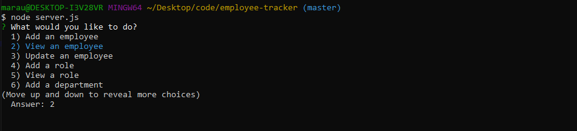
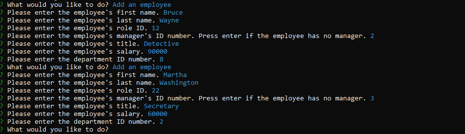
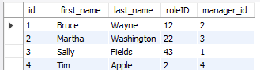
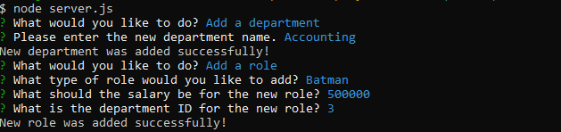

# Employee Tracker

Developers are often tasked with creating interfaces that make it easy for non-developers to view and interact with information stored in databases. Often these interfaces are known as Content Management Systems. In this homework assignment, your challenge is to architect and build a solution for managing a company's employees using node, inquirer, and MySQL.

## Screenshots

The application begins with a simple rawlist for the user to scroll through.

If their database is not already populated, the user can begin by entering information for individual employees.

This information is securely stored in a database, where the user will be able to access later at any time.

The user will also be able to update departments and roles.

## Technology

This application was built using these technologies:

- node
- inquirer
- MySQL

## Link

https://github.com/alexshanless/employee-tracker
